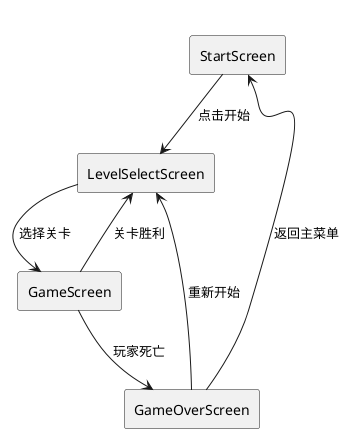
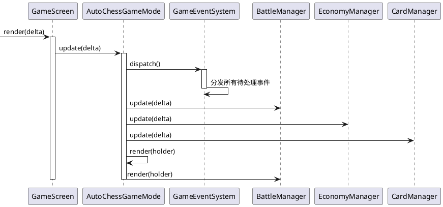
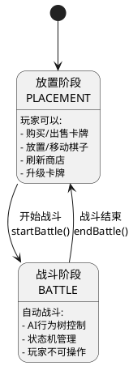
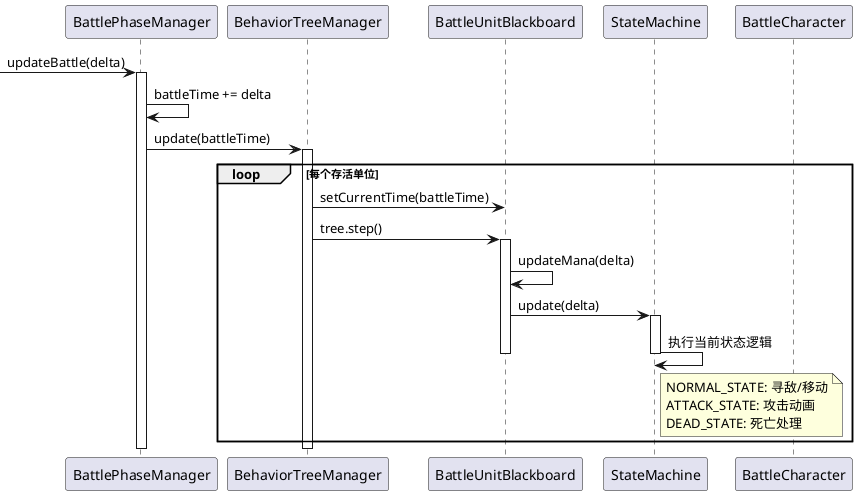
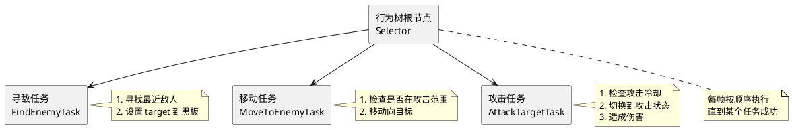
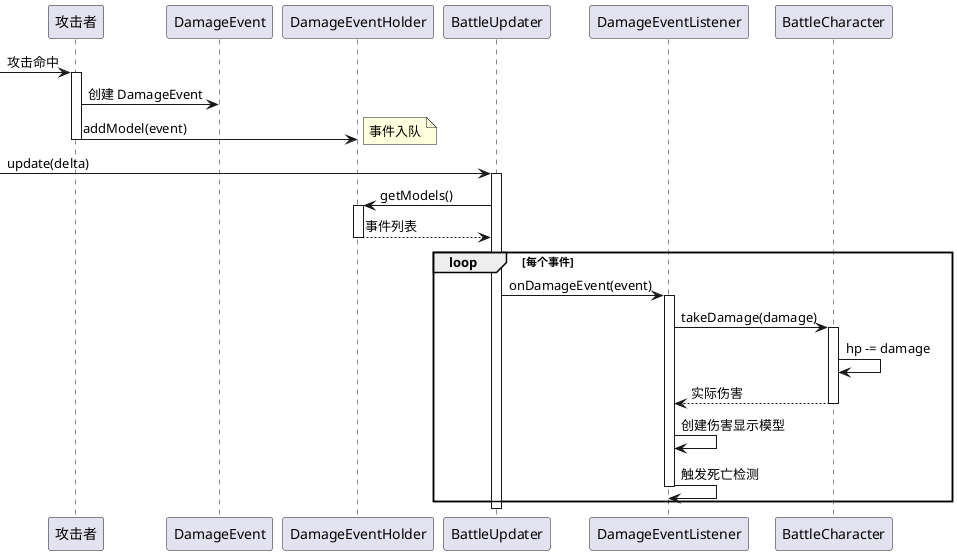
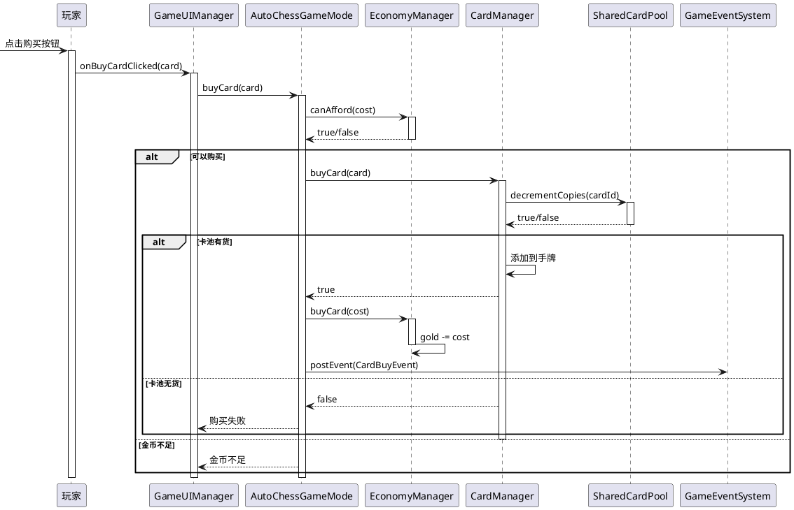
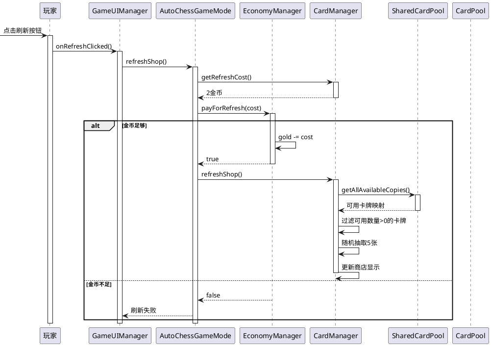

# KZ AutoChess 核心流程

本文档描述游戏的核心流程，帮助新人理解系统运转方式。

## 游戏屏幕流转



**屏幕职责**:
- `StartScreen` - 开始界面，初始化游戏
- `LevelSelectScreen` - 关卡选择，显示关卡进度
- `GameScreen` - 主游戏界面，协调 GameMode
- `GameOverScreen` - 游戏结束，显示结果

## 游戏主循环



**关键点**: 每帧先分发事件，再执行更新，最后渲染。

## 游戏阶段流转



## 战斗循环流程



## 行为树结构



**行为树工厂**: `UnitBehaviorTreeFactory.java:30-60`

## 伤害处理流程



## 购卡流程



## 商店刷新流程



## 关键文件索引

| 流程 | 入口文件 | 关键方法 |
|------|----------|----------|
| 游戏启动 | `KzAutoChess.java:68-81` | `create()` |
| 屏幕切换 | `screens/*.java` | 各 Screen 类 |
| 战斗管理 | `BattleManager.java:59-161` | `BattlePhaseManager` 内部类 |
| 行为树 | `UnitBehaviorTreeFactory.java:30-60` | `create()` |
| 伤害系统 | `BattleUpdater.java:30-90` | `update()` |
| 经济系统 | `EconomyManager.java` | 全类 |
| 卡牌系统 | `CardManager.java` | 全类 |
| 卡池管理 | `SharedCardPool.java:16-119` | `decrementCopies()`, `incrementCopies()` |

## 数据流总结

```
用户输入
    ↓
GameInputHandler (input/GameInputHandler.java)
    ↓
AutoChessGameMode (game/AutoChessGameMode.java)
    ↓
┌─────────────────────────────────────────────────┐
│                  Manager 层                      │
├─────────────────────────────────────────────────┤
│ BattleManager ←→ EconomyManager ←→ CardManager │
│       ↓              ↓               ↓          │
│   Updator        Updator         Updator        │
│       ↓              ↓               ↓          │
│   Model          Model           Model          │
└─────────────────────────────────────────────────┘
    ↓
GameEventSystem (event/GameEventSystem.java)
    ↓
各 Manager 监听事件并响应
    ↓
RenderCoordinator → 渲染输出
```
