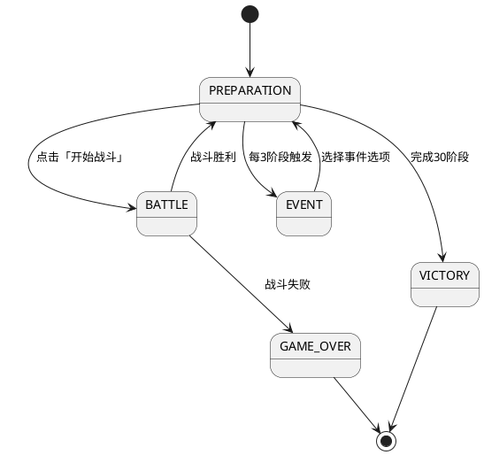

# RoguelikeScreen 和 RoguelikeGameMode 完整实现

## Overview

完善 `RoguelikeScreen` 和 `RoguelikeGameMode` 类的完整实现。RoguelikeScreen 负责 Screen 层面的输入管理、UI 组件展示与更新，不关心游戏具体逻辑；游戏逻辑由 `RoguelikeGameMode` 及其 Manager 层负责。

这是实现 **Roguelike 难度递增模式**（30个连续阶段）的基础架构工作。

## Problem Statement / Motivation

当前 `RoguelikeScreen.java` 和 `RoguelikeGameMode.java` 只是基本骨架，所有生命周期方法为空，无法支持 Roguelike 游戏模式。根据需求文档 `2026-03-21-roguelike-progression-requirements.md`，需要实现：

- 30个连续阶段的难度递增挑战
- 备战阶段界面（商店、升级、刷新）
- 随机事件系统（每3阶段触发）
- Boss 战（第10、20、30阶段）
- 元游戏渐进系统（成就）

## Proposed Solution

遵循项目的 **Model/Updator/Manager/Render 分离** 架构和 **GameMode 抽象层** 模式：

1. **RoguelikeScreen** - Screen 层
   - 创建和管理 RenderHolder
   - 设置 InputMultiplexer（UI Stage + InputHandlerV2）
   - 实现 Screen 生命周期方法
   - 委托游戏逻辑给 RoguelikeGameMode

2. **RoguelikeGameMode** - GameMode 层
   - 实现 GameMode 接口的 8 个方法
   - 管理多个 Manager（BattleManager、EconomyManager、CardManager、RoguelikeManager 等）
   - 协调 Manager 之间的协作
   - 处理游戏阶段转换（备战 → 战斗 → 事件 → 下一阶段）

3. **RoguelikeManager** - 新 Manager（未来任务）
   - 管理 Roguelike 特定逻辑（阶段进度、随机事件、Boss 配置等）
   - 实现 GameEventListener 和 GameRenderer 接口

## Technical Approach

### 架构决策（来自源文档）

根据 `2026-03-21-roguelike-progression-requirements.md` 的**决策1**：

> **采用独立分支架构**：保留现有5关卡系统作为「教学/练习模式」，完全独立的 `RoguelikeGameMode` 和 `RoguelikeScreen`，最小化对现有代码的影响。

### RoguelikeScreen 实现

**文件路径**: `core/src/main/java/com/voidvvv/autochess/screens/RoguelikeScreen.java`

**职责**：
1. 创建 RenderHolder（复用 game.getBatch()）
2. 设置 InputMultiplexer
3. 实现 Screen 生命周期方法
4. 委托给 RoguelikeGameMode

**关键方法**：
```java
@Override
public void show() {
    // 1. 初始化 RenderHolder（复用 game 的 SpriteBatch）
    this.renderHolder = new RenderHolder(game.getBatch(), new ShapeRenderer());

    // 2. 设置输入处理器（InputMultiplexer）
    setupInput();

    // 3. 启动 GameMode
    roguelikeGameMode.onEnter();
}

@Override
public void render(float delta) {
    // 1. 清空屏幕
    Gdx.gl.glClear(GL20.GL_COLOR_BUFFER_BIT);

    // 2. 更新并渲染 GameMode
    roguelikeGameMode.update(delta);
    roguelikeGameMode.render(renderHolder);

    // 3. UI 渲染（如需要）
    renderUI(delta);
}

@Override
public void hide() {
    roguelikeGameMode.onExit();
}
```

### RoguelikeGameMode 实现

**文件路径**: `core/src/main/java/com/voidvvv/autochess/game/RoguelikeGameMode.java`

**职责**：
1. 实现 GameMode 接口的所有方法
2. 管理多个 Manager 的生命周期
3. 协调 Manager 之间的通信
4. 处理游戏阶段转换

**依赖注入模式**（参考 AutoChessGameMode）：
```java
public class RoguelikeGameMode implements GameMode {
    private final KzAutoChess game;
    private final GameEventSystem eventSystem;
    private final RenderCoordinator renderCoordinator;

    // Managers（复用现有 + 新增）
    private final BattleManager battleManager;
    private final EconomyManager economyManager;
    private final CardManager cardManager;
    private final RoguelikeManager roguelikeManager;  // 新增

    // 输入处理
    private final InputHandlerV2 inputHandler;

    public RoguelikeGameMode(KzAutoChess game, ...) {
        // 构造函数注入所有依赖
    }
}
```

**生命周期管理**：
```java
@Override
public void onEnter() {
    battleManager.onEnter();
    economyManager.onEnter();
    cardManager.onEnter();
    roguelikeManager.onEnter();

    inputHandler.initialize(this);
    renderCoordinator.addRenderer(battleManager);
    // ...
}

@Override
public void update(float delta) {
    eventSystem.dispatch();
    eventSystem.clear();

    battleManager.update(delta);
    economyManager.update(delta);
    cardManager.update(delta);
    roguelikeManager.update(delta);
    inputHandler.update(delta);
}

@Override
public void onExit() {
    battleManager.onExit();
    economyManager.onExit();
    cardManager.onExit();
    roguelikeManager.onExit();
}
```

### 输入处理模式

使用新的 **InputHandlerV2** 模式（事件驱动架构）：

```java
// 在 RoguelikeScreen.setupInput() 中
private void setupInput() {
    InputMultiplexer multiplexer = new InputMultiplexer();

    // UI Stage 优先（按钮点击）
    multiplexer.addProcessor(roguelikeGameMode.getUIStage());

    // InputHandlerV2 处理游戏世界交互
    multiplexer.addProcessor(roguelikeGameMode.getInputHandler());

    // 全局快捷键
    multiplexer.addProcessor(new InputAdapter() {
        @Override
        public boolean keyDown(int keycode) {
            if (keycode == Input.Keys.ESCAPE) {
                game.setScreen(new LevelSelectScreen(game));
                return true;
            }
            return false;
        }
    });

    Gdx.input.setInputProcessor(multiplexer);
}
```

### UI 组件展示

**备战界面**（根据需求 R2）：
- 当前阶段数（如 "第 5 / 30 阶段"）
- 当前金币数量
- 玩家当前血量
- 商店卡牌列表
- 操作按钮（购买、升级、刷新、下一阶段）

使用 **Scene2D Stage** + **Table** 布局，参考 GameUIManager 模式。

### 游戏阶段状态机



## System-Wide Impact

### Interaction Graph

```
RoguelikeScreen.show()
  → setupInput() → 创建 InputMultiplexer
  → RoguelikeGameMode.onEnter()
    → battleManager.onEnter() → eventSystem.registerListener()
    → economyManager.onEnter() → eventSystem.registerListener()
    → cardManager.onEnter() → eventSystem.registerListener()
    → roguelikeManager.onEnter() → eventSystem.registerListener()

RoguelikeScreen.render(delta)
  → RoguelikeGameMode.update(delta)
    → eventSystem.dispatch() → 分发事件给所有监听器
    → 各 Manager.update(delta)
  → RoguelikeGameMode.render(holder)
    → renderCoordinator.renderAll() → 各 GameRenderer.render(holder)

RoguelikeScreen.hide()
  → RoguelikeGameMode.onExit()
    → 各 Manager.onExit() → eventSystem.unregisterListener()
```

### Error Propagation

- **输入处理错误**：InputHandlerV2 捕获并记录，不影响游戏循环
- **Manager 初始化错误**：在 onEnter() 中抛出，Screen 停止加载
- **事件分发错误**：GameEventSystem 捕获单个监听器错误，继续分发其他监听器

### State Lifecycle Risks

- **部分初始化**：如果某个 Manager.onEnter() 失败，已注册的监听器可能导致内存泄漏
  - **缓解**：使用 try-catch 包裹，失败时调用已初始化 Manager 的 onExit()
- **屏幕切换**：hide() 未调用可能导致事件监听器未注销
  - **缓解**：在 Screen.hide() 中确保调用 gameMode.onExit()

### API Surface Parity

需要同步修改的接口：
- `GameMode.java` - 无需修改，接口已定义完整
- `GameScreen.java` - 无需修改，独立分支
- `LevelSelectScreen.java` - 需要添加「无尽模式」入口按钮

### Integration Test Scenarios

1. **跨屏幕切换**：LevelSelectScreen → RoguelikeScreen → GameScreen（失败返回）→ LevelSelectScreen
2. **阶段进度持久化**：战斗胜利 → 阶段进度增加 → 商店刷新正确
3. **输入处理**：点击购买按钮 → 经济系统扣费 → 卡牌入手
4. **事件系统**：第3阶段完成 → 随机事件触发 → 选项生效

## Acceptance Criteria

### Functional Requirements

- [ ] **RoguelikeScreen 基础结构**
  - [ ] 实现 Screen 接口的所有方法（show, render, resize, pause, resume, hide, dispose）
  - [ ] 创建 RenderHolder（复用 game.getBatch()）
  - [ ] 设置 InputMultiplexer（UI Stage + InputHandlerV2 + 快捷键）
  - [ ] 实现完整的生命周期管理

- [ ] **RoguelikeGameMode 基础结构**
  - [ ] 实现 GameMode 接口的所有方法（onEnter, update, render, handleInput, pause, resume, onExit, dispose）
  - [ ] 构造函数注入所有依赖（game, managers, eventSystem, renderCoordinator）
  - [ ] 创建并管理必要的 Manager（BattleManager, EconomyManager, CardManager, RoguelikeManager）
  - [ ] 在 onEnter() 中调用所有 Manager 的 onEnter()
  - [ ] 在 update() 中更新所有 Manager
  - [ ] 在 onExit() 中调用所有 Manager 的 onExit()

- [ ] **输入处理**
  - [ ] 使用 InputHandlerV2 处理游戏世界交互
  - [ ] 注册 InputListener 实现具体输入逻辑
  - [ ] UI Stage 优先处理按钮点击
  - [ ] ESC 键返回 LevelSelectScreen

- [ ] **渲染管线**
  - [ ] 使用 RenderCoordinator 管理多个 GameRenderer
  - [ ] 每帧清空屏幕（glClear）
  - [ ] 正确调用 holder.flush() 确保渲染状态一致性

- [ ] **UI 组件**
  - [ ] 创建 Scene2D Stage 并设置 Viewport
  - [ ] 实现备战界面布局（阶段、金币、血量、商店、按钮）
  - [ ] 使用 I18N.get() 获取所有显示文本

- [ ] **阶段状态管理**（基础框架，详细逻辑由 RoguelikeManager 实现）
  - [ ] 支持备战/战斗/事件/游戏结束/胜利状态
  - [ ] 状态转换逻辑正确

### Non-Functional Requirements

- [ ] **性能**
  - [ ] 每帧渲染时间 < 16ms（60 FPS）
  - [ ] 避免每帧创建新对象（复用 GlyphLayout 等）

- [ ] **代码质量**
  - [ ] 遵循 Model/Updator/Manager/Render 分离原则
  - [ ] 无硬编码字符串（使用 I18N 或常量）
  - [ ] 方法长度 < 50 行
  - [ ] 类长度 < 800 行

- [ ] **资源管理**
  - [ ] 正确实现 dispose() 方法
  - [ ] Stage、RenderHolder 在 hide/dispose 时释放

### Quality Gates

- [ ] 代码通过编译
- [ ] 无 FindBugs 警告
- [ ] 代码遵循项目编码规范

## Success Metrics

- RoguelikeScreen 能够正常显示并响应输入
- RoguelikeGameMode 能够正确管理 Manager 生命周期
- 从 LevelSelectScreen 进入 RoguelikeScreen 再返回无内存泄漏
- 备战界面 UI 正确显示（阶段、金币、血量、商店）

## Dependencies & Risks

### Dependencies

- **现有代码**：
  - `GameMode.java` - 接口定义
  - `AutoChessGameMode.java` - 参考实现模式
  - `GameScreen.java` - Screen 模式参考
  - `InputHandlerV2.java` - 输入处理
  - `RenderCoordinator.java` - 渲染协调
  - `GameEventSystem.java` - 事件系统

- **待实现组件**（本计划不包含，后续任务）：
  - `RoguelikeManager` - Roguelike 特定逻辑
  - `RandomEventScreen` - 随机事件界面
  - `GameOverScreen` - 游戏结束界面
  - `assets/roguelike_stage_config.json` - 关卡配置

### Risks

| 风险 | 影响 | 缓解措施 |
|------|------|----------|
| InputHandlerV2 模式不熟悉 | 输入处理错误 | 参考 GameInputHandler + InputHandlerV2 文档 |
| Manager 生命周期管理复杂 | 内存泄漏/事件监听器未注销 | 严格遵循 AutoChessGameMode 模式 |
| UI 布局复杂 | UI 显示异常 | 使用 Scene2D Table，参考 GameUIManager |
| Stage Viewport 配置错误 | UI 坐标错乱 | 使用 ScreenViewport，正确设置 viewport |

## Implementation Plan

### Phase 1: RoguelikeScreen 基础结构

**Tasks**:
1. 完善 `RoguelikeScreen.java` 的所有生命周期方法
2. 创建 RenderHolder（复用 game.getBatch()）
3. 实现 setupInput() 方法
4. 实现基础的 render() 方法
5. 实现 hide() 和 dispose()

**Acceptance**: Screen 能够正常进入和退出，无崩溃

### Phase 2: RoguelikeGameMode 基础结构

**Tasks**:
1. 完善 `RoguelikeGameMode.java` 的所有 GameMode 方法
2. 添加构造函数，注入所有依赖
3. 实现 onEnter() - 初始化所有 Manager
4. 实现 update() - 更新所有 Manager
5. 实现 onExit() - 清理所有 Manager
6. 创建基础的 UI Stage

**Acceptance**: GameMode 能够正确管理生命周期

### Phase 3: UI 组件框架

**Tasks**:
1. 创建备战界面布局（Table + Skin）
2. 添加基础 UI 组件（阶段显示、金币、血量）
3. 添加操作按钮（购买、升级、刷新、下一阶段）
4. 实现 UI 组件的更新逻辑
5. 使用 I18N.get() 获取文本

**Acceptance**: 备战界面正常显示，按钮可点击

### Phase 4: 输入处理集成

**Tasks**:
1. 创建 InputListener 实现
2. 注册到 InputHandlerV2
3. 实现按钮点击回调
4. 实现快捷键处理（ESC 返回）

**Acceptance**: 输入能够正确触发对应逻辑

### Phase 5: 阶段状态框架

**Tasks**:
1. 定义游戏状态枚举（PREPARATION, BATTLE, EVENT, GAME_OVER, VICTORY）
2. 实现状态转换逻辑
3. 为未来 RoguelikeManager 预留接口

**Acceptance**: 状态机框架完整，可扩展

## Sources & References

### Origin

- **Origin document:** [docs/brainstorms/2026-03-21-roguelike-progression-requirements.md](../brainstorms/2026-03-21-roguelike-progression-requirements.md)

**Key decisions carried forward**:
- **决策1：采用独立分支架构** - 创建完全独立的 `RoguelikeGameMode` 和 `RoguelikeScreen`，复用现有 Manager，最小化对现有代码的影响
- **决策2：事件固定间隔触发** - 每3阶段触发（第3、6、9...阶段）
- **决策3：Boss固定周期出现** - 第10、20、30阶段为Boss阶段
- **需求 R2**：备战界面包含阶段数、金币、血量、商店卡牌列表、操作按钮
- **需求 R7**：成就系统（元游戏渐进）

### Internal References

- **GameMode 接口**: `core/src/main/java/com/voidvvv/autochess/game/GameMode.java`
- **AutoChessGameMode 参考实现**: `core/src/main/java/com/voidvvv/autochess/game/AutoChessGameMode.java:43-228`
- **GameScreen 参考实现**: `core/src/main/java/com/voidvvv/autochess/screens/GameScreen.java:86-296`
- **InputHandlerV2**: `core/src/main/java/com/voidvvv/autochess/input/v2/InputHandlerV2.java`
- **RenderCoordinator**: `core/src/main/java/com/voidvvv/autochess/render/RenderCoordinator.java`
- **GameEventSystem**: `core/src/main/java/com/voidvvv/autochess/event/GameEventSystem.java`
- **架构模式文档**: `.claude/docs/architectural_patterns.md`
- **编码指南**: `.claude/skills/kz-autochess-code-guidelines/SKILL.md`

### External References

- [LibGDX Screen 文档](https://libgdx.com/wiki/app/the-screen-interface-and-game-methods)
- [LibGDX Scene2D 文档](https://libgdx.com/wiki/scene2d/scene2d)
- [LibGDS InputMultiplexer 文档](https://libgdx.com/wiki/input/event-handling#multiplexing)

### Related Work

- **最近提交**: `299d9f1` - feat(input): implement InputHandlerV2 with event-driven input processing system
- **相关 PR**: #7 - Merge pull request

## Outstanding Questions (from origin document)

以下问题来自源文档，需要在实施过程中解决：

- [Affects R6][Needs research] **战场效果如何在视觉上呈现？** 需要哪些美术资源？
- [Affects R8][Technical] **游戏结束时如何安全保存成就进度到本地文件？**
- [Affects R4][Technical] **Boss技能系统如何扩展现有技能框架？**
- [Affects R5][Technical] **JSON配置文件如何验证格式和数值范围？**

**注意**: 这些问题不影响本计划（Screen/GameMode 基础架构），但在实现后续功能时需要解决。